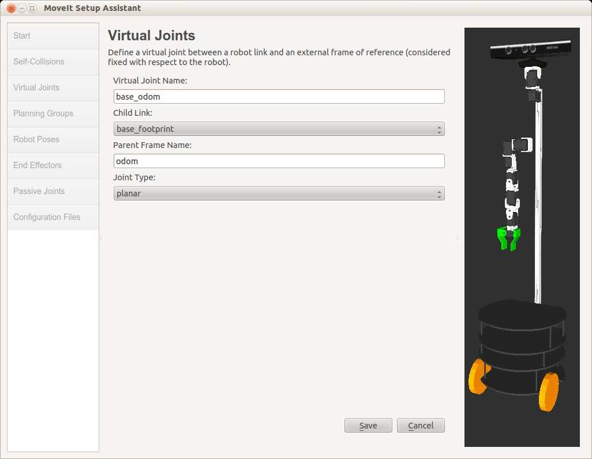

# Пункт 11.10.3 Добавление виртуального joint base\_odom

Виртуальные joints используются в основном для прикрепления робота к миру. В нашем случае мы хотим соединить link `base_footprint` робота со link `odom`, используя planar joint, который позволяет двум links скользить друг над другом в 2D плоскости. \(Если ваш робот использует пакет `robot_pose_ekf` для объединения информации об одометрии колеса с данными из IMU или гироскопа, то вы подключите робота к frame`odom_combined`\).

Создайте виртуальный link base\_odom по следующим инструкциям:

* нажмите на вкладку **Virtual** **Joints** на левой панели   
* нажмите кнопку **Add Virtual Joint**
* в текстовом поле **Virtual Joint Name** введите `base_odom`
* установите **Child Link** в `base_footprint`
* в текстовом поле **Parent Frame Name** введите `odom` или `odom_combined`, если используете пакет `robot_pose_ekf`
* установите **Joint Type** в `planar`
* нажмите кнопку **Save**

#### 

